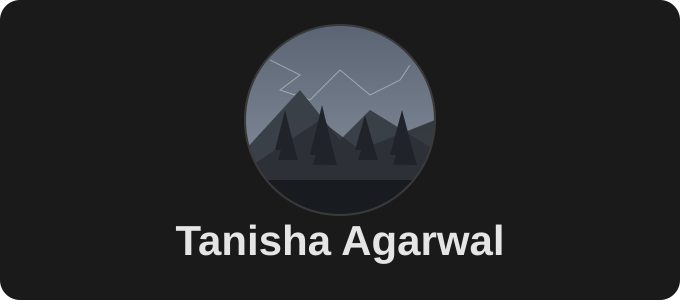

<p align="center">
  
</p>

<p align="center">
  <a href="https://www.linkedin.com/in/tanisha-agarwal-338b65322"></a>
  &nbsp;
  <a href="mailto:tanisha.agarwal0109@gmail.com"></a>
</p>

---

```yaml
name      : Tanisha Agarwal
role      : Backend Developer + AI Enthusiast
education : B.Tech CSE — SNU Kolkata, CGPA 9.01
currently : Building AI-powered backend systems
learning  : React · Cloud
fun_fact  : "My code compiles on the first try about as often as I win the lottery"
```

---

### Stack

<p align="left">
  
  
  
  
  
  
  
  
</p>

---


---

<p align="center">
  
</p>

<p align="center">
  
</p>
